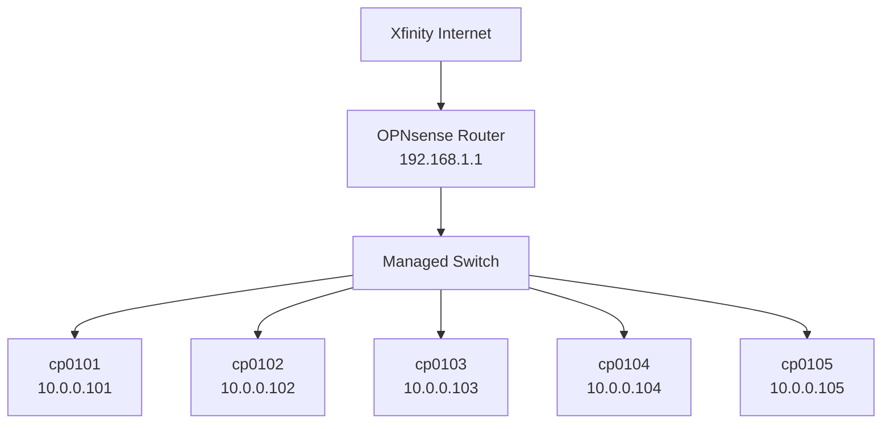
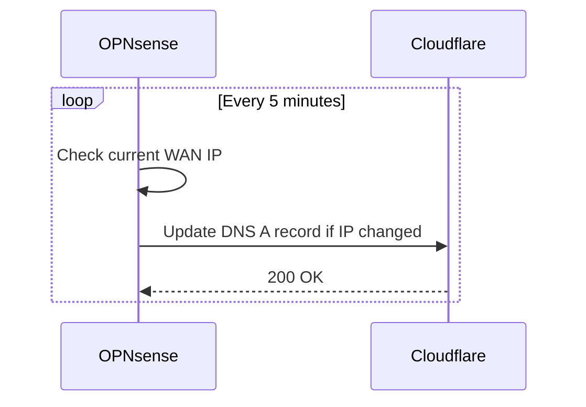

# Network

Overview of the homelab network infrastructure.

## Hardware

| Device | Role |
|--------|------|
| OPNsense appliance | Firewall / router |
| Managed switch | Layer 2 switching |

## Subnets

| Network | CIDR | Gateway | Description |
|---------|------|---------|-------------|
| LAN | 192.168.1.0/24 | 192.168.1.1 | Main local network |
| Servers | 10.0.0.0/24 | 10.0.0.1 | Server VLAN |

## Topology

## Server IP Assignments

| Hostname | IP Address | Role |
|----------|------------|------|
| cp0101 | 10.0.0.101 | Control plane |
| cp0102 | 10.0.0.102 | Worker |
| cp0103 | 10.0.0.103 | Worker |
| cp0104 | 10.0.0.104 | Worker |
| cp0105 | 10.0.0.105 | Worker |

## DNS

- Local DNS resolver: OPNsense Unbound (`192.168.1.1`)
- Public upstream: Cloudflare (`1.1.1.1`, `1.0.0.1`)

## OPNsense

OPNsense is the open-source firewall and routing platform used in the homelab. It runs on dedicated hardware in the rack and serves as the primary gateway and DNS resolver.

| Property | Value |
|----------|-------|
| Version | OPNsense (latest stable) |
| Role | Firewall, router, DNS, DHCP |
| WAN interface | Xfinity (DHCP) |
| LAN interface | 192.168.1.1/24 |

### Features in Use

- **Firewall rules** – Stateful packet filtering between VLANs and WAN
- **DHCP server** – Managed address assignments for all LAN devices
- **DNS resolver (Unbound)** – Local DNS with upstream forwarding
- **Cloudflare DDNS** – Dynamic DNS updates via the built-in DDNS client
- **VLANs** – Segmentation between server, IoT, and management networks

### Interfaces

| Name | Interface | CIDR | Description |
|------|-----------|------|-------------|
| WAN  | em0 | DHCP | Xfinity upstream |
| LAN  | em1 | 192.168.1.1/24 | Main LAN |
| SERVERS | em1.10 | 10.0.0.1/24 | Server VLAN |

## Internet

The homelab uses **Xfinity (Comcast)** as the ISP for broadband internet access.

| Property | Value |
|----------|-------|
| Provider | Xfinity (Comcast) |
| Connection type | Cable / DOCSIS |
| WAN IP | Dynamic (DHCP) |
| Speed | — Mbps down / — Mbps up |

The WAN IP is assigned dynamically by Xfinity, so **Cloudflare DDNS** is used to keep the public hostname up to date.

### Cloudflare DDNS

OPNsense runs a Dynamic DNS (DDNS) client that periodically checks the current public WAN IP and updates a Cloudflare DNS record when it changes.

#### Configuration (OPNsense)

1. Navigate to **Services → Dynamic DNS**.
2. Add a new entry with the following settings:

| Setting | Value |
|---------|-------|
| Service | Cloudflare |
| Interface | WAN |
| Hostname | `<subdomain>.<your-domain>` |
| Username | Cloudflare account email |
| Password | Cloudflare Global API Key or scoped API Token |
| TTL | 120 (or Auto) |
| Check interval | 5 minutes |

3. Save and enable the entry.
4. Verify the record is updated under **Cloudflare Dashboard → DNS**.

#### How It Works

#### Notes

- Use a **scoped API token** (Zone → DNS → Edit) instead of the Global API Key for least-privilege access.
- Ensure the TTL is low (120 s) so propagation is fast after an IP change.
