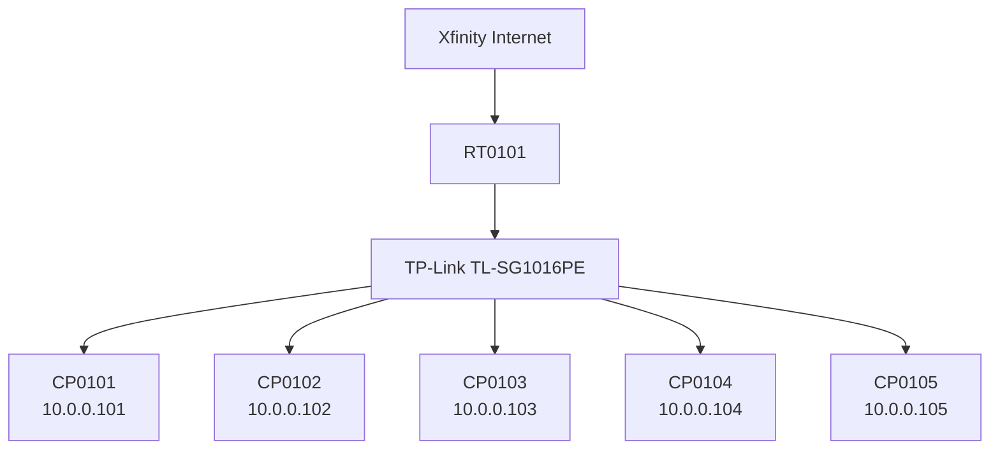
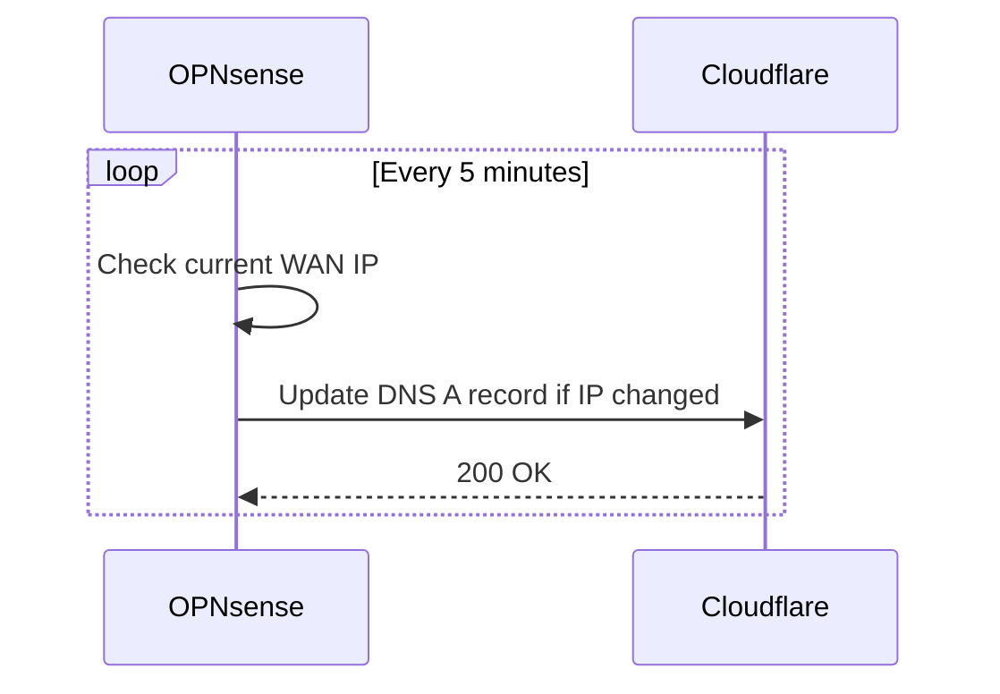

# Network

Overview of the homelab network infrastructure.

## Hardware

| Device | Role |
|--------|------|
| OPNsense appliance | Firewall / router |
| Managed switch | Layer 3 switching |

## Subnets

| Network | CIDR | Gateway | Description |
|---------|------|---------|-------------|
| LAN | 10.0.0.0/8 | 10.0.0.1 | Main local network |

## Topology

## Server IP Assignments

| Hostname | IP Address | Role |
|----------|------------|------|
| CP0101 | 10.0.0.101 | Control plane |
| CP0102 | 10.0.0.102 | Worker |
| CP0103 | 10.0.0.103 | Worker |
| CP0104 | 10.0.0.104 | Worker |
| CP0105 | 10.0.0.105 | Worker |

## DNS

- Local DNS resolver: OPNsense Unbound (`10.0.0.1`)
- Public upstream: Cloudflare (`1.1.1.1`, `1.0.0.1`)

## Internet

The homelab uses **Xfinity (Comcast)** as the ISP for broadband internet access.

| Property | Value |
|----------|-------|
| Provider | Xfinity (Comcast) |
| Connection type | Cable / DOCSIS |
| WAN IP | Dynamic (DHCP) |

The WAN IP is assigned dynamically by Xfinity, so **Cloudflare DDNS** is used
to keep the public hostname up to date.

### Cloudflare DDNS

OPNsense runs a Dynamic DNS (DDNS) client that periodically checks the current
public WAN IP and updates a Cloudflare DNS record when it changes.

#### How It Works

## SSH Access

- `ssh.broswen.com` is a CNAME to `ddns.broswen.com`.
- `ddns.broswen.com` is updated by router-based DDNS to follow the current WAN IP.
- External SSH ports in the `22xxx` range are forwarded to internal hosts in `10.0.0.xxx`.
- Port mapping pattern: `22xxx` → `10.0.0.xxx`.
- The last three digits of the SSH port map to the last three digits of
  the host IP.
  Example: `22101` → `10.0.0.101` / CP0101.
