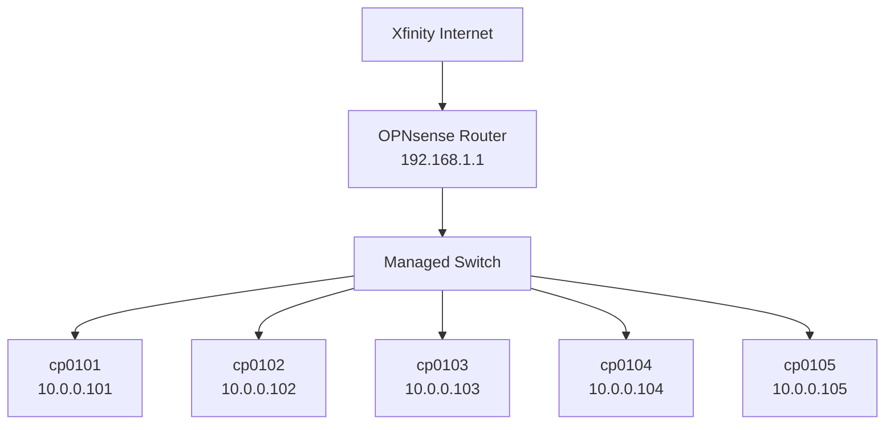

# Network Diagram

## Topology

## Subnets

| Network | CIDR | Gateway | Description |
|---------|------|---------|-------------|
| LAN | 192.168.1.0/24 | 192.168.1.1 | Main local network |
| Servers | 10.0.0.0/24 | 10.0.0.1 | Server VLAN |

## Server IP Assignments

| Hostname | IP Address | Role |
|----------|------------|------|
| cp0101 | 10.0.0.101 | Control plane |
| cp0102 | 10.0.0.102 | Worker |
| cp0103 | 10.0.0.103 | Worker |
| cp0104 | 10.0.0.104 | Worker |
| cp0105 | 10.0.0.105 | Worker |

## DNS

- Local DNS resolver: OPNsense Unbound (`192.168.1.1`)
- Public upstream: Cloudflare (`1.1.1.1`, `1.0.0.1`)
