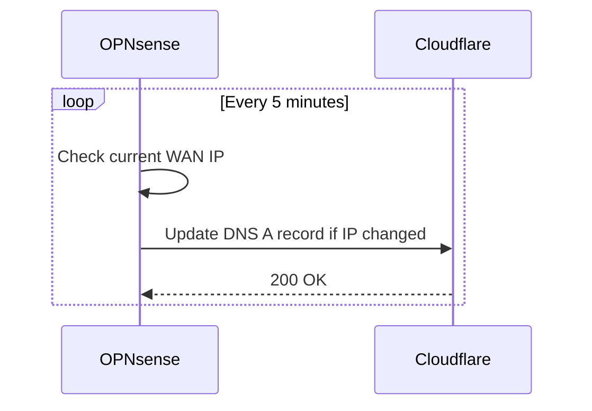

# Internet

## Xfinity Connection

The homelab uses **Xfinity (Comcast)** as the ISP for broadband internet access.

| Property | Value |
|----------|-------|
| Provider | Xfinity (Comcast) |
| Connection type | Cable / DOCSIS |
| WAN IP | Dynamic (DHCP) |
| Speed | — Mbps down / — Mbps up |

The WAN IP is assigned dynamically by Xfinity, so **Cloudflare DDNS** is used to keep the public hostname up to date.

## Cloudflare DDNS

OPNsense runs a Dynamic DNS (DDNS) client that periodically checks the current public WAN IP and updates a Cloudflare DNS record when it changes.

### Configuration (OPNsense)

1. Navigate to **Services → Dynamic DNS**.
2. Add a new entry with the following settings:

| Setting | Value |
|---------|-------|
| Service | Cloudflare |
| Interface | WAN |
| Hostname | `<subdomain>.<your-domain>` |
| Username | Cloudflare account email |
| Password | Cloudflare Global API Key or scoped API Token |
| TTL | 120 (or Auto) |
| Check interval | 5 minutes |

3. Save and enable the entry.
4. Verify the record is updated under **Cloudflare Dashboard → DNS**.

### How It Works

### Notes

- Use a **scoped API token** (Zone → DNS → Edit) instead of the Global API Key for least-privilege access.
- Ensure the TTL is low (120 s) so propagation is fast after an IP change.
