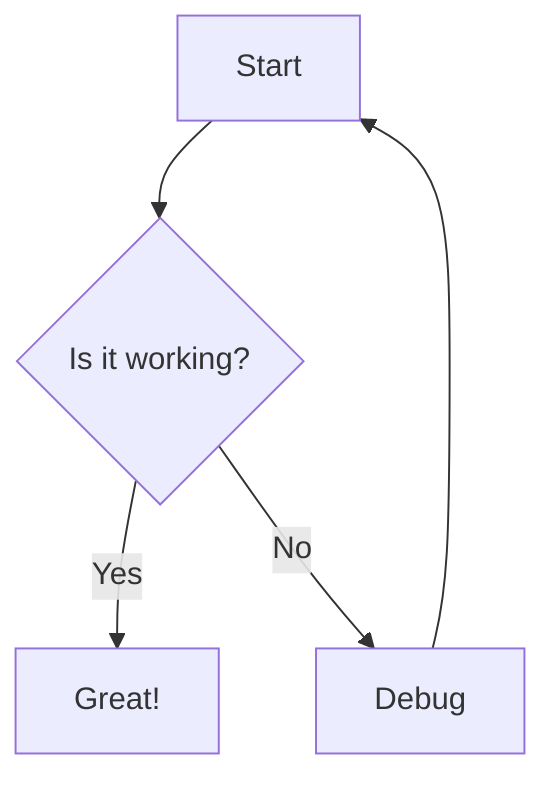

# Welcome to Docs

## Homelab

Documentation for the homelab infrastructure.

| Section | Description |
|---------|-------------|
| [Server Rack](homelab/server-rack.md) | StarTech 12U rack and physical layout |
| [Servers](homelab/servers/index.md) | Server nodes cp0101–cp0105 (CPU, memory, storage) |
| [Network](homelab/network.md) | OPNsense firewall, network diagram, and internet connectivity |

## Example Mermaid Diagram

